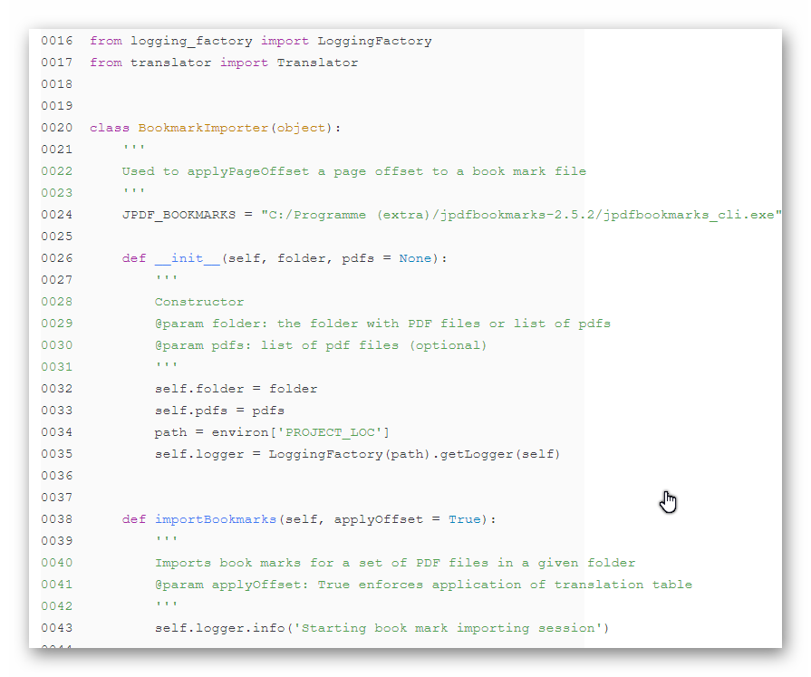

# Code Section Joplin Plugin
This plug-in displays a piece of source code. It does this by supporting a code definition
inside a code definition block.

The code definition looks as follows:

\`\`\``codesection` 
`{` 
`"lang": "python",` 
`"src": "CODE-SOURCE-APPENDIX",` 
`"begin": 1,` 
`"end": 50,` 
`"expandTabs": true,` 
`"tabSize": 4,` 
`"lineNumbers": false,` 
`}` 
\`\`\`

Several entries can be omitted and will be replaced by their defaults. The source language and
the source itself are mandatory.

The inserted code will be displayed using the default renderer for that language including syntax
highlighting.

This could look like this:

## Procedure
 1. Append a code source to the note
 1. Immediately following it add a `codesection` describing the code to be displayed
 1. The description has the shape of a JSON string
 1. The "src" attribute identifies the code source (its id followed by extension)
 1. Alternatively you could copy and paste the code insertion into the quotes of src 

## Known problems
 - The line numbers are colored like the code lines, they should be black.